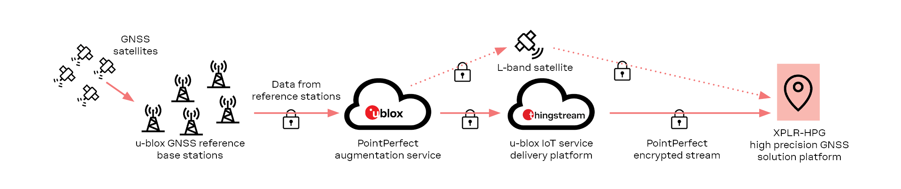
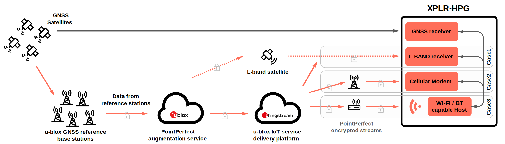

# u-blox High Precision GNSS (HPG) Solution
The XPLR-HPG explorer kits provide a complete platform for evaluation and prototyping of u-blox's high precision GNSS solution with PointPerfect GNSS augmentation service.

Its GNSS ([ZED-F9R](https://www.u-blox.com/en/product/zed-f9r-module)) and communications modules allow it to receive correction data from a satellite broadcast using an L-band satellite GNSS receiver ([NEO-D9S](https://www.u-blox.com/en/product/neo-d9s-series)) or via IP connectivity using Wi-Fi ([NINA-W1](https://www.u-blox.com/en/product/nina-w10-series-open-cpu)/[NORA-W1](https://www.u-blox.com/en/product/nora-w10-series)) or LTE ([LARA-R6](https://www.u-blox.com/en/product/lara-r6-series)).

The correction data is provided by [PointPerfect](https://www.u-blox.com/en/product/pointperfect), the u-blox GNSS augmentation service, and delivered via [Thingstream](https://www.u-blox.com/en/product/thingstream) IoT service delivery platform.

The application running on the Wireless MCU module, makes use of [ubxlib](https://www.u-blox.com/en/product/ubxlib), a set of software modules connecting the various u-blox modules with concise C APIs.

The hardware design and software source code are available on Github so that customers can modify code as needed, add functionality, and start developing their own product.

Two kits are available:  One modular variant ([XPLR-HPG-1](https://www.u-blox.com/en/product/xplr-hpg-1)) and one compact variant ([XPLR-HPG-2](https://www.u-blox.com/en/product/xplr-hpg-2)).

[XPLR-HPG-1](https://www.u-blox.com/en/product/xplr-hpg-1) consists of a base application board (C213) with three mikroBUS™ connectors for mounting of clickboards from [MikroE](https://www.mikroe.com/). It uses [NORA-W1](https://www.u-blox.com/en/product/nora-w10-series) as main application processor and Wi-Fi interface. It comes with clickboards with [ZED-F9R](https://www.u-blox.com/en/product/zed-f9r-module), [NEO-D9S](https://www.u-blox.com/en/product/neo-d9s-series), [LARA-R6](https://www.u-blox.com/en/product/lara-r6-series) and antennas for GNSS and LTE.

[XPLR-HPG-2](https://www.u-blox.com/en/product/xplr-hpg-2) consists of one application board (C214) with all modules mounted. It uses [NINA-W1](https://www.u-blox.com/en/product/nina-w10-series-open-cpu) as main application processor and Wi-Fi interface. [ZED-F9R](https://www.u-blox.com/en/product/zed-f9r-module), [NEO-D9S](https://www.u-blox.com/en/product/neo-d9s-series), [LARA-R6](https://www.u-blox.com/en/product/lara-r6-series) are mounted on the C214 board, and the kit includes antennas for GNSS and LTE.

## The two elements of the HPG Solution
 

### **HPG Hardware**
 

The HPG hardware has a GNSS and a L-band receiver that are used to achieve cm-level precision. A Wi-Fi/BT module and a LTE modem make sure that the board is always connected to the internet. A USB port is used for charging or connecting to a powerful host. The CPU of the Wi-Fi/BT module can be programmed with the **HPG Software** .

Available schematics and production files for the XPLR-HPG kits can be found [here](https://github.com/u-blox/XPLR-HPG-hardware).

 

### **HPG Software**

The HPG software **operates autonomously**, **configures all the modules**, **handles the different correction data sources** and **provides its data to the RTK system.**

This is possible with the [HPG library](./XPLR-HPG-SW/components/) , a library developed on top of [ubxlib](https://github.com/u-blox/ubxlib/tree/hpg), extending its functionality to common use cases for High Precision GNSS tailored projects.

In addition to the [HPG library](./XPLR-HPG-SW/components/), the HPG software includes [examples](./XPLR-HPG-SW/examples/) that showcase the usage of the software in realistic scenarios and use cases such as:

* Correction data over L-band satellite ([cell](./XPLR-HPG-SW/examples/cellular/02_hpg_cell_mqtt_correction_certs/) and [wi-fi](./XPLR-HPG-SW/examples/shortrange/03_hpg_wifi_mqtt_correction_certs/)) (case 1)

* [Correction data over Cellular](./XPLR-HPG-SW/examples/cellular/02_hpg_cell_mqtt_correction_certs/) (case 2)

* [Correction data over Wi-Fi](./XPLR-HPG-SW/examples/shortrange/03_hpg_wifi_mqtt_correction_certs/) (case 3)

XPLR-HPG hardware come preflashed with the [Captive Portal](./XPLR-HPG-SW/examples/shortrange/05_hpg_wifi_mqtt_correction_captive_portal/) demo application, showcasing some key features of the kits. Through this application a user friendly, web based interface is available to the user for configuring and evaluating the XPLR-HPG kits.
