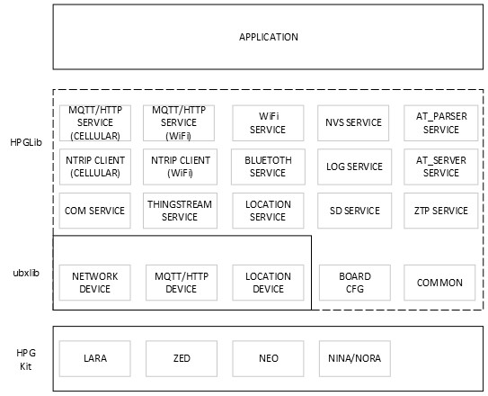

 
 

# XPLR-HPG-Software Components

The folder contains esp-idf components that were developed to facilitate common use cases when integrating u-blox modules into a project. Currently, provided components are tailored to hw modules included in **[XPLR-HPG-1](https://www.u-blox.com/en/product/xplr-hpg-1)** and **[XPLR-HPG-2](https://www.u-blox.com/en/product/xplr-hpg-2)** kits.

## Components List
Name | Description |
--- | --- |
**[ubxlib](https://github.com/u-blox/ubxlib)** | Collection of portable C libraries to interface with u-blox modules. |
**[board manager](./boards/)** | Pin mapping and basic pin functions. |
**[hpglib](./hpglib/)** | Set of libraries that communicate with the u-blox modules using ubxlib, dealing with most of the low-level details, offering high-level functionality to the end application. |
**[xplr_mqtt](./xplr_mqtt/)** | MQTT Wi-Fi library. |
**[xplr_wifi_starter](./xplr_wifi_starter/)** | Wi-Fi connection management library. |
 

 
 

**NOTE:** ubxlib is added as a submodule into the project. Please make sure that you update it using `git submodule update --init --recursive`