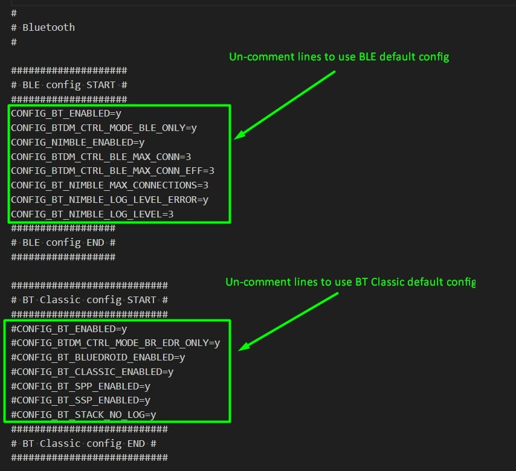

 
 

# Bluetooth Virtual Serial Port module

## Description
Provided library implements virtual COM port interfaces with connected Bluetooth devices.\
The module supports either Bluetooth Classic SPP or BLE.

The basic functionality of this module includes:
- multiple connected device support
- read/write functions
- diagnostics for each connected device

The client device needs to initialize any pairing/connection to the XPLR-HPG board. The state of the client's FSM can be monitored using `xplrBluetoothGetState()`. Any incoming messages are cached by the module and then can be read asynchronously.
 

**Note:**

The mode of operation can be changed from `XPLRBLUETOOTH_MODE` in **[xplr_hpglib_cfg](../../xplr_hpglib_cfg.h)**.\
By default the Bluetooth functionality is disabled to conserve memory. To enable either BLE or Bluetooth classic you need to set `XPLRBLUETOOTH_MODE` to `XPLRBLUETOOTH_MODE_BLE` or `XPLRBLUETOOTH_MODE_BT_CLASSIC` and change these options in the **[sdkconfig.defaults](../../../../sdkconfig.defaults)**

**Note:** After un-commenting the lines in **[sdkconfig.defaults](../../../../sdkconfig.defaults)** you need to delete the **[sdkconfig](../../../../sdkconfig)** file and re-generate it.

**Note:** The Bluetooth connection should be initiated by your client device. After successfully pairing your device to your XPLR-HPG you should be able to connect and exchange data between your device and XPLR-HPG board.

**Note:** For BLE the default UUIDs for Tx and Rx characteristics are compatible with **[Nordic UART Service (NUS)](https://developer.nordicsemi.com/nRF_Connect_SDK/doc/latest/nrf/libraries/bluetooth_services/services/nus.html)**\
Should you wish to use any other service, set `XPLRBLUETOOTH_BLE_CHARS` to `XPLRBLUETOOTH_BLE_CHARS_CUSTOM` in **[bluetooth_service/xplr_bluetooth.h](../../src/bluetooth_service/xplr_bluetooth.h)**  and set the correct UUIDs for your service in **[bluetooth_service/xplr_bluetooth.c](../../src/bluetooth_service/xplr_bluetooth.c)**

 

## Reference examples
[Bluetooth echo server](./../../../../examples/shortrange/08_hpg_bluetooth)\
[Correction data via Wi-Fi MQTT with SW maps integration](./../../../../examples/shortrange/09_hpg_wifi_mqtt_correction_certs_sw_maps)\
[Correction data via Cellular MQTT with SW maps integration](./../../../../examples/cellular/05_hpg_cell_mqtt_correction_certs_sw_maps)

## Local Definitions-Macros
Macro/definitions section which are not inherited from other modules/components or are not part of any **[KConfig](./../../../../docs/README_kconfig.md)**

Name | Value | Description
--- | --- | ---
**`XPLRBLUETOOTH_NUMOF_DEVICES`** | **`3`** | Max number of connected devices supported by the client. Present in [xplr_hpglib_cfg](./../../xplr_hpglib_cfg.h).
**`XPLRBLUETOOTH_MODE`** | **`XPLRBLUETOOTH_MODE_BLE`** | HPGLib Bluetooth client mode of operation, set to `XPLRBLUETOOTH_MODE_OFF` if you don't use Bluetooth in your APP in order to be able to disable the ESP-IDF Bluetooth options (to minimize memory usage). Present in [xplr_hpglib_cfg](./../../xplr_hpglib_cfg.h).