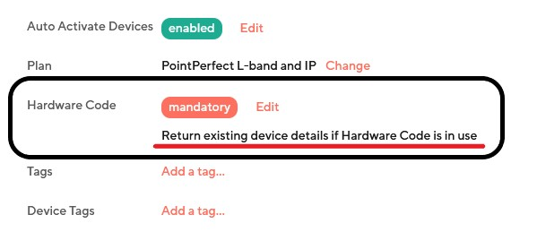
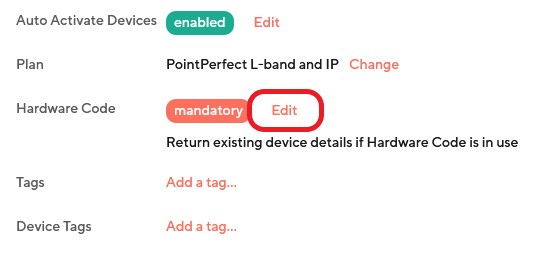
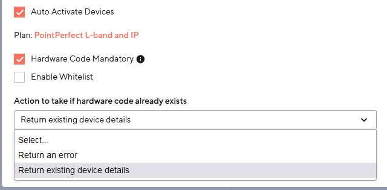

 
 

# Thingstream - Getting Zero Touch Provisioning token and URL

## Description 
 A **token** is used to perform a **ZTP - Zero Touch Provisioning** request.\
In this way we do not have to manually get the necessary settings and data to required for a device to connect to the **[Point Perfect](https://www.u-blox.com/en/product/pointperfect)** services (such as subscription topics, certificates and keys, etc.).

**NOTE**\
**ZTP** will not work with devices created by using a **redemption/promo code**. Instead it only works with purchased plans.

## Getting the token and URL
### Steps
1. Login to your account.
2. On the left navigation menu go to **Location Services** and then **Device Profiles**.\
   If you do not have any device profiles check **[this guide](./README_thingstream_create_profile.md)** on how to create one.
3. Click on the device profile for which you want to get a token.
4. In the pop up window from your right locate the **token** and **Endpoint** sections.
5. Click on the **Copy** icon on the right of each section and use them as needed

**IMPORTANT**\
Check **Hardware Code** field and make sure that the following setting is enabled **Return existing device details if Hardware Code is in use**, otherwise ZTP will return an error.

If this is not the case you can always click edit and then go to **Action to take if hardware code already exists** and select **Return existing device details** from the dropdown.

##

 

### Video
Follow the video below for a more detailed explanation of the steps above:\

### Further reading
You can also have a look at this **[guide](https://developer.thingstream.io/guides/location-services/pointperfect-zero-touch-provisioning)** on the official **Thingstream** documentation site.

 
 

## Caveats
You must first have an account and services subscription on **Thingstream** before start using the services described.

