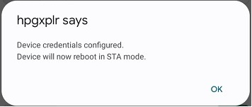

<br>
<br>

# Live tracking map using a captive portal

## Description

The example demonstrates how to use a captive portal to configure u-blox XPLR-HPG-1/2 kits with Wi-Fi and Thingstream credentials to acquire correction data from Thingstream's PointPerfect location service over Wi-Fi. Besides provisioning, the web interface provides a map-tracking application to visualize device's position in real time.

The device (when unconfigured) boots in access point mode, which provides a friendly web interface to set up the required Wi-Fi credentials. As soon as the credentials are stored it switches to STA (station) mode allowing the user to further configure the Thingstream related ones before being able to run the device's live tracking application. When the device is configured, all settings and credentials are stored in MCU's non-volatile memory.

Resetting device in factory mode (aka erasing stored credentials and forcing it to boot in access point mode) is possible by either using the **erase** button on the web interface or by **holding** the boot button on the XPLR-HPG board pressed for at least 5 seconds and then **releasing** it.

When running the code, depending on the debug settings configured and the operating mode, messages are printed to the debug UART providing useful information to the user.<br>

## Building instructions

### Building using Visual Studio Code
Building this example requires selecting the corresponding source files and the debugging options to use the UART communication as a debugger. To do this, follow the steps described below:

1. Open the `XPLR-HPG-SW` folder in VS code.
2. In [CMakeLists](./../../../CMakeLists.txt) select the `hpg_wifi_mqtt_correction_captive_portal` project, making sure that all other projects are commented out:
   ```
   ...
   # shortrange examples
   #set(ENV{XPLR_HPG_PROJECT} "hpg_base")
   #set(ENV{XPLR_HPG_PROJECT} "hpg_wifi_http_ztp")
   #set(ENV{XPLR_HPG_PROJECT} "hpg_wifi_mqtt_correction_certs")
   #set(ENV{XPLR_HPG_PROJECT} "hpg_wifi_mqtt_correction_ztp")
   set(ENV{XPLR_HPG_PROJECT} "hpg_wifi_mqtt_correction_captive_portal")
   ...
   ```
3. Open the [xplr_hpglib_cfg.h](./../../../components/hpglib/xplr_hpglib_cfg.h) file and select debug options you wish to logged in the debug UART.
   ```
   ...
   #define XPLR_HPGLIB_SERIAL_DEBUG_ENABLED    1U
   ...
   #define XPLR_BOARD_DEBUG_ACTIVE            (1U)
   ...
   #define XPLRHELPERS_DEBUG_ACTIVE           (1U)
   #define XPLRGNSS_DEBUG_ACTIVE              (1U)
   ...
   #define XPLRWIFISTARTER_DEBUG_ACTIVE       (1U)
   #define XPLRWIFIDNS_DEBUG_ACTIVE           (1U)
   #define XPLRWIFIWEBSERVER_DEBUG_ACTIVE     (1U)
   #define XPLRMQTTWIFI_DEBUG_ACTIVE          (1U)
   ```
4. Open the [xplr_hpglib_cfg.h](./../../../components/hpglib/xplr_hpglib_cfg.h) file and select debug options you wish to logged in the SD card.\
   For more information about the **logging service of hpglib** follow **[this guide](./../../../components/hpglib/src/log_service/README.md)**
   ```
   ...
   #define XPLR_HPGLIB_LOG_ENABLED             1U
   ...
   #define XPLRGNSS_LOG_ACTIVE                (1U)
   ...
   #define XPLRLOCATION_LOG_ACTIVE            (1U)
   ...
   #define XPLRWIFISTARTER_LOG_ACTIVE         (1U)
   #define XPLRWIFIWEBSERVER_LOG_ACTIVE       (1U)
   #define XPLRMQTTWIFI_LOG_ACTIVE            (1U)
   ...

   ```
5. From the VS code status bar select the `COM Port` that the XPLR-HPGx has enumerated on and the corresponding MCU platform (`esp32` for **[XPLR-HPG-2](https://www.u-blox.com/en/product/xplr-hpg-2)** and `esp32s3` for **[XPLR-HPG-1](https://www.u-blox.com/en/product/xplr-hpg-1)**).
6. In case you have already compiled another project, and the `sdKconfig` file is present under the `XPLR-HPG-SW` folder. Please delete it and run `menu config` by clicking on the "cog" symbol present in the VS Code status bar to set the default configurations.
7. On `SDK tool configuration` tab, click the `Board Options` and select your XPLR-HPG kit. Then click `Save`.
8. After that, `Build, Flash and Monitor` the project to the MCU using the "flame" icon.
<br>

### Building using ESP-IDF from a command line
1. Navigate to the `XPLR-HPG-SW` root folder.
2. In [CMakeLists](./../../../CMakeLists.txt) select the `hpg_wifi_mqtt_correction_captive_portal` project, making sure that all other projects are commented out.
3. Open the [xplr_hpglib_cfg.h](./../../../components/hpglib/xplr_hpglib_cfg.h) file and select debug options you wish to be logged in the SD card or the debug UART.
4. In case you have already compiled another project and the `sdKconfig` file is present under the `XPLR-HPG-SW` folder please delete it and run `idf.py menuconfig`.
5. Navigate to the `Board Options` section and select the board you wish to build the example for. Press `q` and answer `Y` to save the configuration.
6. Run `idf.py build` to compile the project.
7. Run `idf.py -p COMX flash` to flash the binary to the board, where **COMX** is the `COM Port` that the XPLR-HPGx has enumerated on.
8. Run `idf.py monitor -p COMX` to monitor the debug UART output.

## Adding Wi-Fi credentials using the captive portal

To access the captive portal and configure the device, it's necessary to use a browser on a host device to connect to the XPLR-HPG board. The host device could be a phone, tablet, computer, or similar device. The use of **Chrome / Firefox / Safari** is recommended. It isn't allowed to connect to the captive portal by multiple hosts/browser instances simultaneously. In case that you cannot access the captive portal or you see a message notifying you that the websocket died please close any open tabs / browser instances and try again.

Please follow the steps described below to set up all credentials on the web interface:

1. From the host device of your choise, connect to the access point that is created by the XPLR-HPG kit. It will be shown as `xplr-hpg-x-xxxx` depending on the kit you are using.

   **NOTE**: It is necessary to accept the usage of the network when XPLR-HPG acts as an access point before uploading the Thingstream certificates.

2. Open a browser and type the URL: **http://xplr-hpg.local** to access the captive portal and the XPLR-HPG configuration page. You can also use the IP **192.168.4.1** to access the web interface.

   

   **NOTE**: If the user changes the browser window, a disconnect event from the XPLR-HPG board may be noticed. When it happens, a page refresh is recommended.

3. On the bottom of the web interface three buttons are present:
   - <span style="border-radius: 3px;padding:0px 5px;background-color:gray;color:white">Config</span>: Use it to set the Wi-Fi and Thingstream credentials.
   - <span style="border-radius: 3px;padding:0px 5px;background-color:#FFC300;color:black">Reboot</span>: Use it to power cycle the board.
   - <span style="border-radius: 3px;padding:0px 5px;background-color:red;color:white">Erase</span>: Use it to erase the XPLR-HPG credentials. Press it when you want to clean the Wi-Fi and Thingstream credentials.

   

4. Click the <span style="border-radius: 3px;padding:0px 5px;background-color:gray;color:white">Config</span> button, wait for the settings page to load, and use the form to set your Wi-Fi credentials.

5. Use the **Scan** button to search for the available access points, and type the SSID and Password in the corresponding form field. After that, click **Set**.

   

   **NOTE**: XPLR-HPG can connect only to 2.4GHz enabled access points. Please make sure your access point (or your smartphone's hotspot function if using a smartphone as an access point) operates at this frequency.

   Completing this step will force the XPLR-HPG kit to restart and connect to the access point using the provided credentials.

   

## Accessing XPLR-HPG on the captive portal

To access the device use the URL: http://xplr-hpg.local/ from your browser and the web interface should appear, showing the XPLR-HPG data and status. Click the navigation menu to expand the menu options and select Live Tracker.

**Note:** If for any reason the device cannot be accessed using the URL then please use the IP address assigned to it from router's/access point's DHCP server. The address assigned is periodically shown in the serial debug messages.

Before accessing the live tracking feature of the captive portal it is needed to configure your Thingstream credentials. To do so please:
   1. Switch the host device to the same access point that the XPLR-HPG kit is connected and download the required configuration file from **Thingstream** by following this **[guide](./../../../docs/README_thingstream_ucenter_config.md)**

   2. Using the web interface (config tab), upload the configuration file and select your options of preference regarding your region, Thingstream plan and whether you wish to enable the SD logging and dead reckoning functionalities of the kit.

   Don't forget to click the **Set** button on each available option.

   

After performing the step above, it is possible to access the live tracking map and see the device location in real time.


## Erasing the XPLR-HPG credentials

There are two ways to clean the Wi-Fi and the Thingstream credentials:
   - <span style="border-radius: 3px;padding:0px 5px;background-color:red;color:white">Erase</span>: Hitting the Erase button at the bottom of the web interface should erase credentials from the XPLR-HPG board and make it boot at AP mode as well.
   - Boot button: Pressing and holding the Boot button on the XPLR-HPG board for 5 seconds should erase the credentials from the device memory.

## Modules-Components used

Name | Description
--- | ---
**[boards](./../../../components/boards)** | Board variant selection
**[hpglib/common](./../../../components/hpglib/src/common)** | Common functions.
**[xplr_wifi_starter](./../../../components/xplr_wifi_starter)** | XPLR Wi-Fi connection manager with DNS and webeserver features
**[xplr_mqtt](./../../../components/xplr_mqtt)** | XPLR MQTT manager
**[hpglib/location_services/xplr_gnss_service](./../../../components/hpglib/src/location_service/gnss_service/)** | XPLR GNSS location device manager
**[hpglib/location_services/location_service_helpers](./../../../components/hpglib/src/location_service/location_service_helpers/)** | Internally used by **[xplr_gnss_service](./../../../components/hpglib/src/location_service/gnss_service/)**
**[hpglib/log_service](./../../../components/hpglib/src/log_service/)** | XPLR logging service.
**[hpglib/sd_service](./../../../components/hpglib/src/sd_service/)** | Internally used by **[log_service](./../../../components/hpglib/src/log_service/)**.


## Notes
- In case that a device is already configured and the user tries to change any of the Thingstream options, a manual reset to the device is required.
- In case that other examples have been flashed to the device you need to perform a flash erase using the IDF terminal.
- When configuring Thingstream subscription plan in captive portal settings page, please make sure that the subscription plan is also set in Thingstream portal, otherwise the device will fail to acquire position data.
- Hot swap of SD card is not supported.
- Dead reckoning requires a calibration session each time the device boots. Please see [this](./../../../docs/README_dead_reckoning.md) guide.
- **XPLR-HPG-1** kit comes pre-flashed with SD interface disabled. To activate SD logging please flash it again using the firmware provided in the [release folder](./../../../bin/releases/C213/hpg_wifi_mqtt_correction_captive_portal/), making sure that a SD card is inserted to the board.
