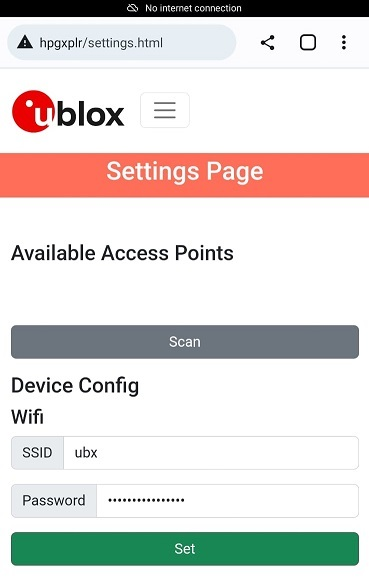
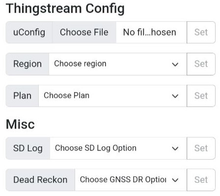

<br>
<br>

# Live tracking map using a captive portal

## Description

The example demonstrates how to use a captive portal to configure u-blox XPLR-HPG-1/2 kits with Wi-Fi and Thingstream credentials to acquire correction data from Thingstream's Point Perfect location service over Wi-Fi. Besides provisioning, the web interface provides a map-tracking application to visualize device's position in real time.

The device (when unconfigured) boots in access point mode, which provides a friendly web interface to set up the required credentials to run the device's live tracking. When the device is configured, and the credentials are stored in MCU's non-volatile memory, it switches to station mode for connecting to the provided Wi-Fi.

Resetting device in factory mode (aka erasing stored credentials and forcing it to boot in access point mode) is possible by either using the **erase** button on the web interface or by **holding** the boot button on the XPLR-HPG board pressed for at least 5 seconds and then **releasing** it.

When running the code, depending on the debug settings configured and the operating mode, messages are printed to the debug UART providing useful information to the user, similar to the ones shown bellow:

```
I [(4948) xplrWifiStarter|wifiApPrintInfo|1610|: Access-Point is up with following settings:
SSID: xplr-hpg-2-XXXX
Password:
IP: 192.168.4.1
D [(4961) xplrWifiWebserver|xplrWifiWebserverStart|227|: Starting server on port: '80'
D [(4971) xplrWifiWebserver|xplrWifiWebserverStart|231|: Registering URI handlers
D [(4977) xplrWD [S4a7ter|pllWiWiDis|xrnsrFem|3r|266|: Socket cee successf
983) xplrWifiDns|xDns_server|272|: Socket bound, port 53
D [(4988) xplrWifiDns|xDns_server|275|: Waiting for data
I [(6237) xplrGnss|xplrGnssPrintLocation|760|: Printing location info.
======== Location Info ========
Location type: 1
Location fix type: 3D
Location latitude: 55.612962 (raw: 556129617)
Location longitude: 12.987300 (raw: 129873005)
Location altitude: 61.381000 (m) | 61381 (mm)
Location radius: 20.464000 (m) | 20464 (mm)
Speed: 0.460800 (km/h) | 0.128000 (m/s) | 128 (mm/s)
Estimated horizontal accuracy: 20.4642 (m) | 20464.20 (mm)
Estimated vertical accuracy: 19.3823 (m) | 19382.30 (mm)
Satellite number: 8
Time UTC: 08:36:01
Date UTC: 05.05.2023
Calendar Time UTC: Fri 05.05.2023 08:36:01
===============================
I [(6283) xplrGnss|xplrGnssPrintGmapsLocation|612|: Printing GMapsLocation!
https://maps.google.com/?q=55.612851,12.985865
```
<br>

## Building instructions

Building this example requires selecting the corresponding source files and the debugging options to use the UART communication as a debugger. To do this, follow the steps described below:

1. Open the `XPLR-HPG-SW` folder in VS code.
2. In [CMakeLists](./../../../CMakeLists.txt) select the `hpg_wifi_mqtt_correction_captive_portal` project, making sure that all other projects are commented out:
   ```
   ...
   # shortrange examples
   #set(ENV{XPLR_HPG_PROJECT} "hpg_base")
   #set(ENV{XPLR_HPG_PROJECT} "hpg_wifi_http_ztp")
   #set(ENV{XPLR_HPG_PROJECT} "hpg_wifi_mqtt_correction_certs")
   #set(ENV{XPLR_HPG_PROJECT} "hpg_wifi_mqtt_correction_ztp")
   set(ENV{XPLR_HPG_PROJECT} "hpg_wifi_mqtt_correction_captive_portal")
   ...
   ```
3. Open the [xplr_hpglib_cfg.h](./../../../components/hpglib/xplr_hpglib_cfg.h) file and select debug options you wish to logged in the debug UART.
   ```
   ...
   #define XPLR_HPGLIB_SERIAL_DEBUG_ENABLED    1U
   ...
   #define XPLR_BOARD_DEBUG_ACTIVE            (1U)
   ...
   #define XPLRHELPERS_DEBUG_ACTIVE           (1U)
   #define XPLRGNSS_DEBUG_ACTIVE              (1U)
   ...
   #define XPLRWIFISTARTER_DEBUG_ACTIVE       (1U)
   #define XPLRWIFIDNS_DEBUG_ACTIVE           (1U)
   #define XPLRWIFIWEBSERVER_DEBUG_ACTIVE     (1U)
   #define XPLRMQTTWIFI_DEBUG_ACTIVE          (1U)
   ```
4. From the VS code status bar select the `COM Port` that the XPLR-HPGx has enumerated on and the corresponding MCU platform (`esp32` for **[XPLR-HPG-2](https://www.u-blox.com/en/product/xplr-hpg-2)** and `esp32s3` for **[XPLR-HPG-1](https://www.u-blox.com/en/product/xplr-hpg-1)**).
5. In case you have already compiled another project, and the `sdKconfig` file is present under the `XPLR-HPG-SW` folder. Please delete it and run `menu config` by clicking on the "cog" symbol present in the VS Code status bar to set the default configurations.
6. On `SDK tool configuration` tab, click the `Board Options` and select your XPLR-HPG kit. Then click `Save`.
7. After that, `Build, Flash and Monitor` the project to the MCU using the "flame" icon.
<br>

## Adding the credentials on the captive portal

To access the captive portal, it's necessary to use a browser on a host device to connect to the XPLR-HPG board. The host device could be a phone, tablet, computer, or similar device. The use of **Chrome / Firefox / Safari** is recommended. It isn't allowed to connect to the captive portal by multiple hosts/browser instances simultaneously. In case that you cannnot access the captive portal or you see a message notifying you that the websocket died please close any open tabs / browser instances and try again.

Please follow the steps described below to set up all credentails on the web interface:

1. Download the 3 required files from **Thingstream** by following this **[guide](./../../../docs/README_thingstream_certificates.md)**:
   - **Client Key**
   - **Client Certificate**
   - **Root Certificate**
2. Store these 3 files on the host you will use to access the XPLR-HPG board. Also, copy the Client ID and keep it in a place that is easy to access it.
3. Access the Wi-Fi connections on the host device, search for the Wi-Fi connection named "**xplr-hpg-X-XXXX**" and connect to it.

**NOTE**: It is necessary to accept the usage of the network when XPLR-HPG acts as an access point before uploading the Thingstream certificates.

4. Open the browser and type the URL: **http://hpgxplr** to open the captive portal and access the XPLR-HPG board configurations. You also can use the IP **192.168.4.1** to access the web interface.


**NOTE**: If the user changes the browser window, they may experience a disconnection from the XPLR-HPG board. When it happens, a page refresh is recommended.

5. On the bottom of the web interface three buttons are present:
   - <span style="border-radius: 3px;padding:0px 5px;background-color:gray;color:white">Config</span>: Use it to set the Wi-Fi and Thingstream credentials.
   - <span style="border-radius: 3px;padding:0px 5px;background-color:#FFC300;color:black">Reboot</span>: Use it to power cycle the board.
   - <span style="border-radius: 3px;padding:0px 5px;background-color:red;color:white">Erase</span>: Use it to erase the XPLR-HPG credentials. Press it when you want to clean the Wi-Fi and Thingstream credentials.


6. Click the <span style="border-radius: 3px;padding:0px 5px;background-color:gray;color:white">Config</span> button, wait for the settings page to load, and use the form to set all the required credentials.
7. Use the **Scan** button to search for the available access points, and type the SSID and Password in the corresponding form field. After that, click **Set**.



**NOTE**: If the smartphone only starts the hotspot at 5 GHz, then XPLR-HPG cannot connect.

8. Following, copy and paste the Client ID, upload the Thingstream files, select the device region (EU - Europe or US - United States) and your Thingstream subscription plan. Don't forget to click the **Set** button on each Thingstream credential to define them.



9. Finally, a rebooting message will appear and restart the XPLR-PG board in Station mode.


## Accessing XPLR-HPG on the captive portal

After defining all the configurations the device will restart in station mode. To access the device use the URL: http://xplr-hpg.local/ from your browser and the web interface should appear, showing the XPLR-HPG data and status. Click the navigation menu to expand the menu options and select Live Tracker.

**Note:** If for any reason the device cannot be accessed using the URL then please use the IP address assigned to it from router's/access point dhcp server. The address assigned is periodically shown in the serial debug messages.


 After doing the step above, it is possible to access the live tracking map and see the device location in real time.

 

## Cleaning the XPLR-HPG credentials

There are two ways to clean the Wi-Fi and the Thingstream credentials:
   - <span style="border-radius: 3px;padding:0px 5px;background-color:red;color:white">Erase</span>: Hitting the Erase button at the bottom of the web interface should erase credentials from the XPLR-HPG board and make it boot at AP mode as well.
   - Boot button: Pressing and holding the Boot button on the XPLR-HPG board for 5 seconds should erase the credentials from the device memory.

## Modules-Components used

Name | Description 
--- | --- 
**[boards](./../../../components/boards)** | Board variant selection
**[hpglib/common](./../../../components/hpglib/src/common)** | Common functions.
**[xplr_wifi_starter](./../../../components/xplr_wifi_starter)** | XPLR Wi-Fi connection manager with DNS and webeserver features
**[xplr_mqtt](./../../../components/xplr_mqtt)** | XPLR MQTT manager
**[hpglib/location_services/xplr_gnss_service](./../../../components/hpglib/src/location_service/gnss_service/)** | XPLR GNSS location device manager
**[hpglib/location_services/location_service_helpers](./../../../components/hpglib/src/location_service/location_service_helpers/)** | Internally used by **[xplr_gnss_service](./../../../components/hpglib/src/location_service/gnss_service/)**


## Notes
- In case that a device is already configured and the user tries to change the subscription plan, a manual reset to the device is required.
- When configuring Thingstream subscription plan in captive portal settings page, please make sure that the subscription plan is also set in Thingstream otherwise the device will fail to acquire position data.