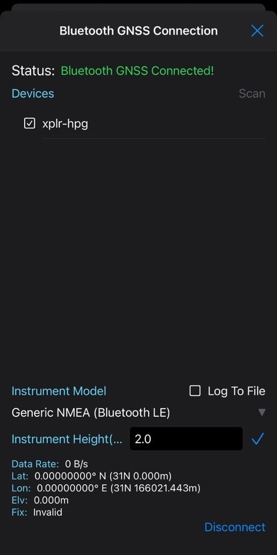

<br>
<br>

# Correction data via Wi-Fi MQTT with SW Maps via bluetooth

## Description

This example is based on the **[03_hpg_wifi_mqtt_correction_certs](../03_hpg_wifi_mqtt_correction_certs)** example but also provides the functionality to connect your mobile device via BLE and use your XPLR-HPG kit as a Bluetooth GNSS module. This example was designed to be compatible with SW Maps application (**[iOS](https://apps.apple.com/us/app/sw-maps/id6444248083)** & **[Android](https://play.google.com/store/apps/details?id=np.com.softwel.swmaps)**). No special setup is needed, just pair your XPLR-HPG board to your mobile device and connect through the SW Maps mobile app.



**NOTES**: 
- Due to system memory limitations this example is compatible exclusively with the BLE mode of the HPGLib Bluetooth module.
- BT Classic is only supported in HPG-2 boards (NINA-W1). In HPG-1 (NORA-W1) only BLE is available. 

After successfully retrieving correction data from Thingstream and connecting your bluetooth device, the messages printed on the console should look similar to these:

```
I [(94813) xplrBluetooth|bleGapEventCb|1423|: Device connected
I [(94948) xplrBluetooth|bleDiagnostics|1272|: Device handle: 0 | Device address: 95:1d:50:7f:76:00 | RSSI: -67 dBm
I [(98364) xplrGnss|gnssLocationPrinter|3717|: Printing location info.
======== Location Info ========
Location type: 1
Location fix type: RTK-FLOAT
Location latitude: 36.590816 (raw: 36590816)
Location longitude: 20.412264 (raw: 20412264)
Location altitude: 108.788000 (m) | 108788 (mm)
Location radius: 1.110000 (m) | 1110 (mm)
Speed: 0.165600 (km/h) | 0.046000 (m/s) | 46 (mm/s)
Estimated horizontal accuracy: 1.1102 (m) | 1110.20 (mm)
Estimated vertical accuracy: 1.2896 (m) | 1289.60 (mm)
Satellite number: 11
Time UTC: 10:45:12
Date UTC: 13.10.2023
Calendar Time UTC: Fri 13.10.2023 10:45:12
===============================
I [(98411) xplrGnss|xplrGnssPrintGmapsLocation|1649|: Printing GMapsLocation!
I [(98418) xplrGnss|xplrGnssPrintGmapsLocation|1650|: Gmaps Location: https://maps.google.com/?q=36.590816,20.412264
I [(98445) app|appSendLocationToBt|667|: Sent location successfully to Bluetooth device with handle -> [0]
```
<br>

## Build instructions

### Building using Visual Studio Code
Building this example requires to edit a minimum set of files in order to select the corresponding source files and configure Wi-Fi and MQTT settings using Kconfig.
Please follow the steps described bellow:

1. Open the `XPLR-HPG-SW` folder in VS code.
2. In [CMakeLists](./../../../CMakeLists.txt) select the `hpg_wifi_mqtt_correction_certs_sw_maps` project, making sure that all other projects are commented out:
   ```
   ...
   # shortrange examples
   #set(ENV{XPLR_HPG_PROJECT} "hpg_wifi_mqtt_correction_captive_portal")
   #set(ENV{XPLR_HPG_PROJECT} "hpg_wifi_mqtt_correction_sd_config_file")
   #set(ENV{XPLR_HPG_PROJECT} "hpg_bluetooth")
   set(ENV{XPLR_HPG_PROJECT} "hpg_wifi_mqtt_correction_certs_sw_maps")
   #set(ENV{XPLR_HPG_PROJECT} "hpg_kit_info")
   ...
   ```
3. Open the [xplr_hpglib_cfg.h](./../../../components/hpglib/xplr_hpglib_cfg.h) file and select debug options you wish to logged in the debug UART.
   ```
   ...
   #define XPLR_HPGLIB_SERIAL_DEBUG_ENABLED    1U
   ...
   #define XPLR_BOARD_DEBUG_ACTIVE            (1U)
   ...
   #define XPLRHELPERS_DEBUG_ACTIVE           (1U)
   #define XPLRGNSS_DEBUG_ACTIVE              (1U)
   ...
   #define XPLRWIFISTARTER_DEBUG_ACTIVE       (1U)
   #define XPLRMQTTWIFI_DEBUG_ACTIVE          (1U)
   ```
4. Open the [app](./main/hpg_wifi_mqtt_correction_certs_sw_maps.c) and select if you need logging to the SD card for your application.
   ```
   #define APP_SD_LOGGING_ENABLED      0U
   ```
   This is a general option that enables or disables the SD logging functionality for all the modules. <br> 
   To enable/disable the individual module debug message SD logging:
- Open the [xplr_hpglib_cfg.h](./../../../components/hpglib/xplr_hpglib_cfg.h) file and select debug options you wish to logged in the SD card.\
   For more information about the **logging service of hpglib** follow **[this guide](./../../../components/hpglib/src/log_service/README.md)**
   ```
   ...
   #define XPLR_HPGLIB_LOG_ENABLED             1U
   ...
   #define XPLRGNSS_LOG_ACTIVE                (1U)
   ...
   #define XPLRLOCATION_LOG_ACTIVE            (1U)
   ...
   #define XPLRWIFISTARTER_LOG_ACTIVE         (1U)
   ...
   #define XPLRMQTTWIFI_LOG_ACTIVE            (1U)
   ...

   ```
   - Alternatively, you can enable or disable the individual module debug message logging to the SD card by modifying the value of the `appLog.logOptions.allLogOpts` bit map, located in the [app](./main/hpg_wifi_mqtt_correction_certs_sw_maps.c). This gives the user the ability to enable/disable each logging instance in runtime, while the macro options in the [xplr_hpglib_cfg.h](./../../../components/hpglib/xplr_hpglib_cfg.h) give the option to the user to fully disable logging and ,as a result, have a smaller memory footprint.
5. From the VS code status bar select the `COM Port` that the XPLR-HPGx has enumerated on and the corresponding MCU platform (`esp32` for **[XPLR-HPG2](https://www.u-blox.com/en/product/xplr-hpg-2)** and `esp32s3` for **[XPLR-HPG1](https://www.u-blox.com/en/product/xplr-hpg-1)**).
6. By default the Bluetooth functionality is disabled to conserve memory, refer to the **[Bluetooth module README](../../../components/hpglib/src/bluetooth_service/README.md)** for instructions on how to enable BLE / Bluetooth Classic.
7. In case you have already compiled another project and the `sdKconfig` file is present under the `XPLR-HPG-SW` folder please delete it and run `menu config` by clicking on the "cog" symbol present in the vs code status bar.
8. Navigate to the `Board Options` section and select the board you wish to build the example for.
9. Under the `Board Options` settings make sure to select the GNSS module that your kit is equipped with. By default ZED-F9R is selected.
10. Navigate to the [Dead Reckoning](./../../../docs/README_dead_reckoning.md) and Enable/Disable it according to your needs.
11. Go to `XPLR HPG Options -> Correction Data Source -> Choose correction data source for your GNSS module` and select the **Correction data source** you need for your GNSS module.
12. Copy the MQTT **Hostname** from **Thingstream**, go to `XPLR HPG Options -> MQTT Settings -> Broker Hostname` and configure your MQTT broker host as needed. Remember to put **`"mqtts://"`** in front.\
    You can also skip this step since the correct **hostname** is already configured.
13. Copy the MQTT **Client ID** from **Thingstream**, go to `XPLR HPG Options -> MQTT Settings -> Client ID` and configure it as needed.
14. Go to `XPLR HPG Options -> Wi-Fi Settings -> Access Point SSID` and configure you **Access Point's SSID** as needed.
15. Go to `XPLR HPG Options -> Wi-Fi Settings -> Access Point Password` and configure you **Access Point's Password** as needed.
16. Go to `XPLR HPG Options -> Bluetooth Settings` and input the **Device name** (this is the name your XPLR-HPG kit will have as a Bluetooth device).

**NOTE**: The default settings allow 2 connected devices for Bluetooth Classic and 3 connected devices for BLE.
17. Download the 3 required files from **Thingstream** by following this **[guide](./../../../docs/README_thingstream_certificates.md)**:
   - **Client Key**
   - **Client Certificate**
   - **Root Certificate**
18. **Copy and Paste** the contents of **Client Key**, named **device-\[client_id\]-pp-key.pem**, into **client.key** located inside the main folder of the project. Replace everything inside the file.
19. **Copy and Paste** the contents of **Client Certificate**, named **device-\[client_id\]-pp-cert.crt**, into **client.crt** located inside the main folder of the project. Replace everything inside the file.
20. **Root Certificate** is already provided as a file **root.crt**. Check if the contents have changed and if yes then copy and Paste the contents of **Root Certificate** into **root.crt** located inside the main folder of the project. Replace everything inside the file.
21. Click `Save` and then `Build, Flash and Monitor` the project to the MCU using the "flame" icon.
<br>

**NOTES**:
- In the described file names above **\[client_id\]** is equal to your specific **DeviceID**.
- It is recommended to **disable** the SD card Hot Plug functionality in this example, due to memory constraints.
- When selected correction data source is LBAND, it is recommended to have SD logging **disabled**, due to memory constraints.
<br>

### Building using ESP-IDF from a command line
1. Navigate to the `XPLR-HPG-SW` root folder.
2. In [CMakeLists](./../../../CMakeLists.txt) select the `hpg_wifi_mqtt_correction_certs_sw_maps` project, making sure that all other projects are commented out.
3. Open the [xplr_hpglib_cfg.h](./../../../components/hpglib/xplr_hpglib_cfg.h) file and select debug options you wish to be logged in the SD card or the debug UART.
4. In case you have already compiled another project and the `sdKconfig` file is present under the `XPLR-HPG-SW` folder please delete it and run `idf.py menuconfig`.
5. Navigate to the fields mentioned above from step 7 through 20 and provide the appropriate configuration. When finished press `q` and answer `Y` to save the configuration.
6. Run `idf.py build` to compile the project.
7. Run `idf.py -p COMX flash` to flash the binary to the board, where **COMX** is the `COM Port` that the XPLR-HPGx has enumerated on.
8. Run `idf.py monitor -p COMX` to monitor the debug UART output.

## Kconfig/Build Definitions-Macros
This is a description of definitions and macros configured by **[Kconfig](./../../../docs/README_kconfig.md)**.\
In most cases, these values can be directly overwritten in the source code or just configured by running **[Kconfig](./../../../docs/README_kconfig.md)** before building.\
**[Kconfig](./../../../docs/README_kconfig.md)** is used for easy/fast parameter configuration and building, without the need of modifying the source code.

Name | Default value | Belongs to | Description | Manual overwrite notes
--- | --- | --- | --- | ---
**`CONFIG_BOARD_XPLR_HPGx_C21x`** | "CONFIG_BOARD_XPLR_HPG2_C214" | **[boards](./../../../components/boards)** | Board variant to build firmware for.|
**`CONFIG_GNSS_MODULE`** | "ZED-F9R" | **[boards](./../../../components/boards)** | Selects the GNSS module equipped. |
**`CONFIG_XPLR_GNSS_DEADRECKONING_ENABLE`** | "Disabled" | **[hpg_hpg_wifi_mqtt_correction_certs_sw_maps](./main/hpg_wifi_mqtt_correction_certs_sw_maps.c)** | Enables or Disables Dead Reckoning functionality. |
**`CONFIG_XPLR_CORRECTION_DATA_SOURCE`** | "Correction via IP" | **[hpg_hpg_wifi_mqtt_correction_certs_sw_maps](./main/hpg_wifi_mqtt_correction_certs_sw_maps.c)** | Selects the source of the correction data to be forwarded to the GNSS module. |
**`CONFIG_XPLR_WIFI_SSID`** | "ssid" | **[hpg_hpg_wifi_mqtt_correction_certs_sw_maps](./main/hpg_wifi_mqtt_correction_certs_sw_maps.c)** | AP SSID name to try and connect to. | You can replace this value by either directly editing source code in the app or using **[KConfig](./../../../docs/README_kconfig.md)**.v
**`CONFIG_XPLR_WIFI_PASSWORD`** | "password" | **[hpg_hpg_wifi_mqtt_correction_certs_sw_maps](./main/hpg_wifi_mqtt_correction_certs_sw_maps.c)** | AP password to try and connect to.| You can replace this value by either directly editing source code in the app or using **[KConfig](./../../../docs/README_kconfig.md)**.
**`CONFIG_XPLR_MQTTWIFI_CLIENT_ID`** | "MQTT Client ID" | **[hpg_hpg_wifi_mqtt_correction_certs_sw_maps](./main/hpg_wifi_mqtt_correction_certs_sw_maps.c)** | A unique MQTT client ID as taken from **Thingstream**. | You will have to replace this value to with your specific MQTT client ID, either directly editing source code in the app or using Kconfig.
**`CONFIG_XPLR_MQTTWIFI_THINGSTREAM_HOSTNAME`** | "mqtts://pp.services.u-blox.com" | **[hpg_hpg_wifi_mqtt_correction_certs_sw_maps](./main/hpg_wifi_mqtt_correction_certs_sw_maps.c)** | URL for MQTT client to connect to, taken from **Thingstream**.| There's no need to replace this value unless the URL changes in the future. You can replace this value by either directly editing source code in the app or using **[KConfig](./../../../docs/README_kconfig.md)**.
<br>

## Local Definitions-Macros
This is a description of definitions and macros found in the sample which are only present in main files.\
All definitions/macros below are meant to make variables more identifiable.\
You can change local macros as you wish inside the app.

Name | Description 
--- | --- 
**`APP_PRINT_IMU_DATA`** | Switches dead reckoning printing messages ON or OFF.
**`APP_SERIAL_DEBUG_ENABLED `** | Switches debug printing messages ON or OFF.
**`APP_SD_LOGGING_ENABLED   `** | Switches logging of the application messages to the SD card ON or OFF.
**`KIB `** | Helper definition to denote a size of 1 KByte
**`APP_MQTT_PAYLOAD_BUF_SIZE `** | Definition of MQTT buffer size of 10 KBytes.
**`APP_LOCATION_PRINT_PERIOD `** | Period in seconds on how often we want our print location function \[**`appPrintLocation(uint8_t periodSecs)`**\] to execute. Can be changed as desired.
**`APP_DEAD_RECKONING_PRINT_PERIOD `** | Period in seconds on how often we want our print dead reckoning data function \[**`appPrintDeadReckoning(uint8_t periodSecs)`**\] to execute. Can be changed as desired.
**`APP_GNSS_I2C_ADDR `** | I2C address for **[ZED-F9R](https://www.u-blox.com/en/product/zed-f9r-module)** module.
**`APP_LBAND_I2C_ADDR`** | I2C address for **[NEO-D9S](https://www.u-blox.com/en/product/neo-d9s-series)**  module.
**`APP_ORIGIN_COUNTRY`** | Correction data region.
**`APP_CORRECTION_TYPE`** | Thingstream subscription plan.
**`APP_MAX_TOPICLEN`** | Maximum topic buffer size.
**`DEVICES_PRINT_INTERVAL`** | Interval, in seconds, of how often we want the connected device diagnostics to be printed.
**`APP_BT_BUFFER_SIZE`** | The size of the allocated Bluetooth buffer in bytes.
**`APP_BT_MAX_MESSAGE_SIZE`** | The max size of any Bluetooth message in bytes.\
**`APP_SD_HOT_PLUG_FUNCTIONALITY`** | Option to enable the hot plug functionality of the SD card driver (being able to insert and remove the card in runtime).
**`APP_INACTIVITY_TIMEOUT`** | Time in seconds to trigger an inactivity timeout and cause a restart.
**`APP_RESTART_ON_ERROR`** | Trigger soft reset if device in error state.
**`APP_ENABLE_CORR_MSG_WDG`** | Option to enable the correction message watchdog mechanism.
<br>

## Modules-Components used

Name | Description 
--- | --- 
**[boards](./../../../components/boards)** | Board variant selection.
**[hpglib/common](./../../../components/hpglib/src/common)** | Common functions.
**[xplr_wifi_starter](./../../../components/xplr_wifi_starter)** | XPLR Wi-Fi connection manager.
**[xplr_mqtt](./../../../components/xplr_mqtt)** | XPLR MQTT manager.
**[hpglib/location_services/xplr_gnss_service](./../../../components/hpglib/src/location_service/gnss_service/)** | XPLR GNSS location device manager.
**[hpglib/location_services/xplr_lband_service](./../../../components/hpglib/src/location_service/lband_service/)** | XPLR LBAND service manager.
**[hpglib/location_services/location_service_helpers](./../../../components/hpglib/src/location_service/location_service_helpers/)** | Internally used by **[xplr_gnss_service](./../../../components/hpglib/src/location_service/gnss_service/)**.
**[hpglib/bluetooth_service](./../../../components/hpglib/src/bluetooth_service/)** | XPLR Bluetooth client.
**[hpglib/log_service](./../../../components/hpglib/src/log_service/)** | XPLR logging service.
**[hpglib/sd_service](./../../../components/hpglib/src/sd_service/)** | Internally used by **[log_service](./../../../components/hpglib/src/log_service/)**.
